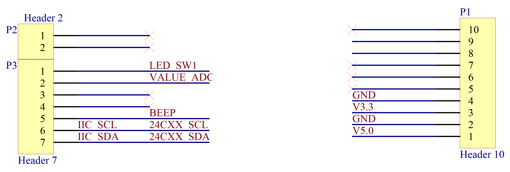

# BearPi-HM_Nano开发板传感器驱动开发——MQ2读取烟雾浓度
本示例将演示如何在BearPi-HM_Nano开发板上使用E53_SF1读取烟雾浓度，当烟雾浓度超标时蜂鸣器发出警报


## E53_SF1 API分析
本案例主要使用了以下API完成烟雾浓度读取
### E53SF1Init()
```C
void E53SF1Init(void)
```
 **描述：**

初始化E53_SF1

### MQ2PPMCalibration()
```C
void MQ2PPMCalibration(void)
```
 **描述：**
MQ2传感器校准
### GetMQ2PPM()
```C
float GetMQ2PPM(void)
```
 **描述：**

获取烟雾浓度ppm


## 硬件设计
本案例将用到 E53_SF1 智慧烟感扩展板与 BearPi-HM_Nano 开发板，其中E53_SF1扩展板原理图如下，ADC输出引脚为第五脚，将E53_SF1扩展板插在 BearPi-HM_Nano 开发板上后，该ADC输出引脚与GPIO_13相连接，通过查看芯片手册可知GPIO_13对应的是 ADC Channel 6 ,所以需要编写软件去读取ADC Channel 6的电压实现对烟雾浓度的读取。




E53_SF1 智慧烟感扩展板与 BearPi-HM_Nano 开发板安装如下图所示


## 软件设计

**主要代码分析**


首先调用 `E53SF1Init()` 函数初始化E53_SF1所接的引脚的功能，再等待1s后进行校准，获取正常环境下传感器的参数，然后循环调用 `GetMQ2PPM()` 函数读取ppm值并通过串口打印出来，当ppm大于100时触发蜂鸣器报警，小于100时关闭报警。

```C
static void ExampleTask(void)
{
    int ret;
    float  ppm;
    
    E53SF1Init();
    //Sensor calibration
    usleep(1000000);        
    MQ2PPMCalibration();  
    
    while (1) {
        printf("=======================================\r\n");
        printf("*************E53_SF1_example***********\r\n");
        printf("=======================================\r\n");
        //get mq2 ppm
        ret = GetMQ2PPM(&ppm);
        if (ret != 0) {
            printf("ADC Read Fail\n");
            return ;
        }
        printf("ppm:%.3f \n", ppm);
        if (ppm > 15) {
            BeepStatusSet(ON);
        } else {
            BeepStatusSet(OFF);
        }
        usleep(1000000);                          
    } 
}
```


## 编译调试

### 修改 BUILD.gn 文件
修改`applications\sample\bearpi_hm_nano\app`路径下 BUILD.gn 文件，指定 `e53_sf1_example` 参与编译。
```r
"C1_e53_sf1_mq2:e53_sf1_example",
#"C2_e53_ia1_temp_humi_pls:e53_ia1_example",
#"C3_e53_sc1_pls:e53_sc1_example",
#"C4_e53_sc2_axis:e53_sc2_example",
#"C5_e53_is1_infrared:e53_is1_example",
```

    


### 运行结果

示例代码编译烧录代码后，按下开发板的RESET按键，通过串口助手查看日志，会打印以下信息，对着烟雾探头制作烟雾，ppm会升高蜂鸣器发出报警。
```c
=======================================
*************E53_SF1_example***********
=======================================
ppm:19.094 
=======================================
*************E53_SF1_example***********
=======================================
ppm:18.797 
```

