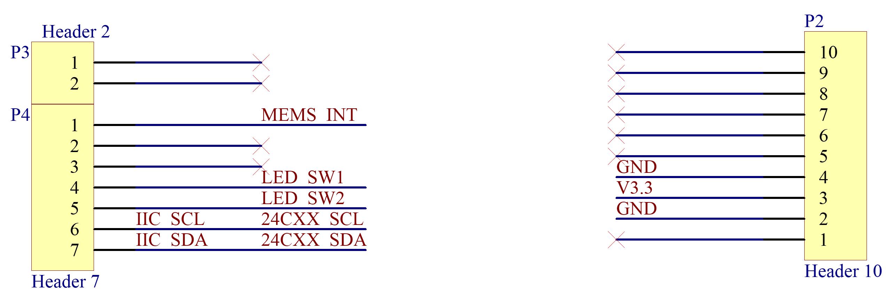

# BearPi-HM_Nano开发板传感器驱动开发——E53_SC2读取三轴加速度
本示例将演示如何在BearPi-HM_Nano开发板上使用E53_SC2读取三轴加速度


## E53_SC2 API分析
本案例主要使用了以下API完成三轴加速度读取
### E53SC2Init()
```C
int E53SC2Init(void);
```
 **描述：**

初始化E53_SC2

### E53SC2ReadData()
```C
int E53SC2ReadData(E53SC2Data *ReadData);
```
 **描述：**
读取三轴加速度及温度


## 硬件设计
本案例将用到 E53_SC2 智慧井盖扩展板与 BearPi-HM_Nano 开发板，其中E53_SC2扩展板原理图如下，三轴加速度传感器MPU6050是通过I2C来驱动。




E53_SC2 智慧井盖扩展板与 BearPi-HM_Nano 开发板安装如下图所示


## 软件设计

**主要代码分析**


首先调用 `E53SC2Init()` 函数初始化E53_SC2所接的引脚的功能，然后循环调用 `E53SC2ReadData()` 函数读取三轴加速度并通过串口打印出来，设置第一次读出的三轴加速度为水平状态，当倾斜开发板后会点亮扩展板上倾斜倾斜状态的灯

```C
static void ExampleTask(void)
{
    uint8_t ret;
    E53SC2Data data;
    int X = 0, Y = 0, Z = 0;

    ret = E53SC2Init();
    if (ret != 0) {	
      printf("E53_SC2 Init failed!\r\n");
      return;
    }
    while (1) {
        printf("=======================================\r\n");
        printf("*************E53_SC2_example***********\r\n");
        printf("=======================================\r\n");
        ret = E53SC2ReadData(&data);
        if (ret != 0) {	
            printf("E53_SC2 Read Data!\r\n");
            return;
        }
        printf("\r\n**************Temperature      is  %d\r\n", (int)data.Temperature);
        printf("\r\n**************Accel[0]         is  %d\r\n", (int)data.Accel[0]);
        printf("\r\n**************Accel[1]         is  %d\r\n", (int)data.Accel[1]);
        printf("\r\n**************Accel[2]         is  %d\r\n", (int)data.Accel[2]);
        if (X == 0 && Y == 0 && Z == 0) {
            X = (int)data.Accel[0];
            Y = (int)data.Accel[1];
            Z = (int)data.Accel[2];
        } else {
            if (X + 100 < data.Accel[0] || X - 100 > data.Accel[0] || Y + 100 < data.Accel[1] 
                || Y - 100 > data.Accel[1] || Z + 100 < data.Accel[2] || Z - 100 > data.Accel[2]) {
                LedD1StatusSet(OFF);
                LedD2StatusSet(ON);
            } else {
                LedD1StatusSet(ON);
                LedD2StatusSet(OFF);
            }
        }
        usleep(1000000);
    }
}
```


## 编译调试

### 修改 BUILD.gn 文件
修改`applications\sample\bearpi_hm_nano\app`路径下 BUILD.gn 文件，指定 `e53_sc2_example` 参与编译。
```r
#"C1_e53_sf1_mq2:e53_sf1_example",
#"C2_e53_ia1_temp_humi_pls:e53_ia1_example",
#"C3_e53_sc1_pls:e53_sc1_example",
"C4_e53_sc2_axis:e53_sc2_example",
#"C5_e53_is1_infrared:e53_is1_example",
```

    


### 运行结果<a name="section18115713118"></a>

示例代码编译烧录代码后，按下开发板的RESET按键，通过串口助手查看日志，会打印温度和三轴加速度信息。当倾斜开发板后会点亮扩展板上倾斜倾斜状态的灯。
```c
=======================================
*************E53_SC2_example***********
=======================================

******************************Temperature      is  25

******************************Accel[0]         is  45

******************************Accel[1]         is  3

******************************Accel[2]         is  2089
=======================================
*************E53_SC2_example***********
=======================================

******************************Temperature      is  25

******************************Accel[0]         is  49

******************************Accel[1]         is  5

******************************Accel[2]         is  2087
```

